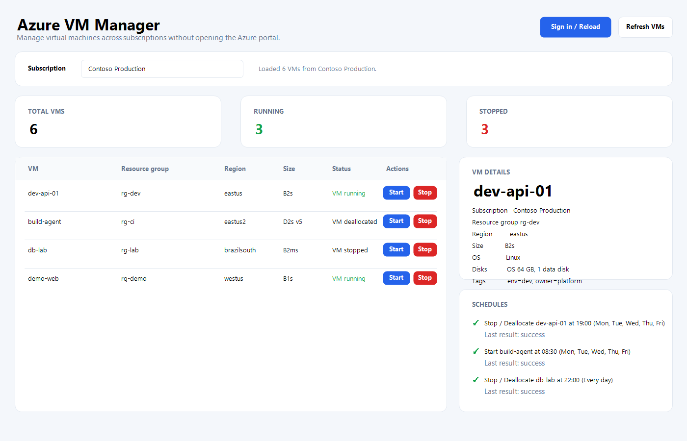

# Cloud VM Manager

[](https://github.com/ppiova/VMAzureApp/actions/workflows/msix-release.yml)
[](LICENSE)
[](https://apps.microsoft.com/detail/9NGRMHHVCV4B)

Cloud VM Manager is a Windows desktop app for managing Azure virtual machines across subscriptions without opening the Azure portal.

## Install

Get it from the Microsoft Store:

<a href="https://apps.microsoft.com/detail/9NGRMHHVCV4B?mode=direct">
  
</a>

You can also install the MSIX package from [GitHub Releases](../../releases) — see [MSIX releases](#msix-releases).

## Preview



## Features

- Interactive Microsoft Entra sign-in.
- Lists accessible Azure subscriptions, and reloads virtual machines automatically when you switch subscription.
- Fast VM listing: power states are fetched in parallel in a single subscription-wide query.
- Search and filter virtual machines by name, resource group, region, size, OS, or status.
- Start, stop/deallocate, restart, and hibernate virtual machines (hibernate is offered only for VMs that support it).
- Select multiple VMs and start or stop them in bulk.
- Live power-state refresh after every action, plus a manual refresh and an optional auto-refresh every 45 seconds.
- Local schedules to start or stop/deallocate VMs on selected days and times.
- VM details panel with subscription, resource group, region, size, OS, disks, zones, tags, and status.
- Modern WPF UI with a system tray icon and quick actions.

## Requirements

- Windows 10 or later.
- Azure permissions to read and operate virtual machines in the target subscriptions.

## Development

Building from source requires the .NET 10 SDK.

Run locally:

```powershell
dotnet run --project .\VMAzureApp\VMAzureApp.csproj
```

Build:

```powershell
dotnet build .\VMAzureApp\VMAzureApp.csproj
```

## Scheduling notes

Schedules are stored locally under the user's application data folder and run in local machine time. The app must be open or running in the system tray for scheduled VM actions to execute.

## MSIX releases

This repository includes a Windows Application Packaging Project and a GitHub Actions workflow that builds an MSIX package when a version tag is pushed:

```powershell
git tag v1.0.0
git push origin v1.0.0
```

See [PACKAGING.md](PACKAGING.md) for signing certificate and GitHub Secrets setup.

If Windows shows certificate error `0x800B010A`, download the release ZIP and run `Install-AzureVMManager.ps1`, or import the included `.cer` before opening the `.msix`.

## License

This project is licensed under the [MIT License](LICENSE). You can use, modify, and improve it freely. The software is provided as-is, without warranty or liability for misuse.
